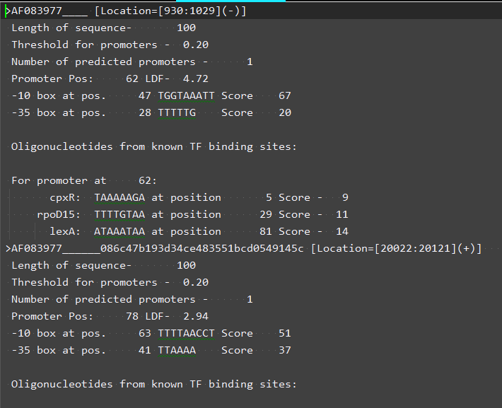
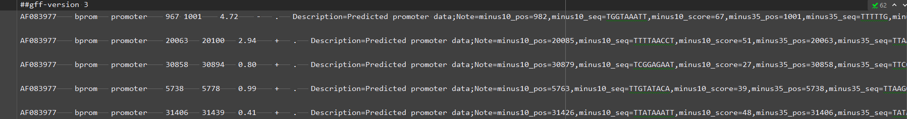

# BPROM to GFF3 converter

Uses regular expressions to extract data from the output of BPROM 
(a bacterial promoter prediction software tool) and converts it to the GFF3 file format.

For a converted example file, see ```2022_1_23_bprom_as_gff3_AF083977.txt```

### Converts the following input:


### To the following GFF3 output:


### Run at the command line
```python
python bprom_gff3_converter.py -f bprom_output_file_name/path.txt
```